# 밑바닥부터 시작하는 데이터 과학

1. **네트워크 관련**
- **연결 중심성(degree centrality, Cd)**
    
    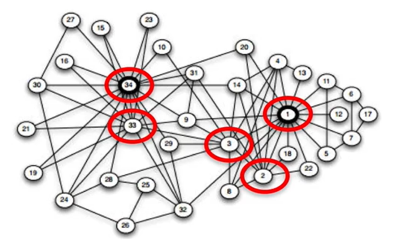
    
    - 중심성 지수에서 가장 간단하면서 기본적인 지표
    - 이웃이 얼마나 많은가(한 Node에 직접적으로 연결된 모든 Edge의 개수)로 지수를 평가
    - 중심성: 그래프에서 꼭짓점이나 노드의 상대적 중요성을 나타내는 척도

2. **파이썬 관련**
- **dict와 defaultdict**
    
    
    
    - dict: 기본적으로 map과 같이 key-value 형태로 데이터를 저장하지만, map과 달리 중복된 key 값이 허용된다.
    - get(), pop(), update(), keys(), items() 메소드 내장
    - {"김연아": "피겨스케이팅", "류현진": "야구", "손흥민": "축구", "귀도": "파이썬"}
    
    
    
    - defaultdict: dictionary와 동일한 형태지만, 모든 key에 대해 기본값을 설정해줌
    - 존재하지 않는 key 값에 접근하게 되면 에러가 발생하는 dict의 문제점을 커버한 자료구조, 일장일단이 있다고 함
        
        <aside>
        💡
        
        ```python
        from collections import defaultdict
        
        # key가 관심사, value가 사용자 id
        user_ids_by_interest = defaultdict(list)
        
        for user_id, interest in interests:
            user_ids_by_interest[interest].append(user_id)
        ```
        
        </aside>
        
    - 책에서는 각 관심사에 대한 사용자 인덱스를 만들 때 선언하여 사용함
- **파이썬의 특징 및 파이썬스러운 코드**
    - 코드의 단락을 구분하는데 중괄호 대신 들여쓰기 사용
    
    ```python
    for i in [1, 2, 3, 4, 5]:
        print(i)
        for j in [1, 2, 3, 4, 5]:
            print(j)
            print(i + j)
        print(i)
    print("done looping")
    ```
    
    - 파이썬 3에서는 실수 나눗셈이 기본 (책은 파이썬2라서 정수 나눗셈이 기본)
    - 함수(0개 혹은 그 이상의 인자를 입력받아 결과를 출력하는 규칙)은 def로 선언
    
    ```python
    def double(x):
        """이 곳은 함수에 대한 설명을 적어 놓는 공간이다.
        예를 들어, "이 함수는 입력된 변수에 2를 곱한 값을 출력해 준다"
        라는 설명을 추가할 수 있다"""
        return x * 2
    ```
    
    - 파이썬 함수는 변수로 할당되거나 함수의 인자로 전달도 가능(first-class/일급 함수의 특징)
    - 짧은 익명의 람다 함수도 생성 가능
    
    ```python
    def apply_to_one(f):
        """인자가 1인 함수 f를 호출"""
        return f(1)
    
    my_double = double                  # 방금 정의한 함수를 나타냄
    x = apply_to_one(my_double)         # 2
    y = apply_to_one(lambda x: x + 4)   # 5
    ```
    
    - 변수에 람다 함수를 할당할 수 있지만, def로 선언하는 게 적절함
    - 함수의 인자에는 기본값 할당 가능
    
    ```python
    def my_print(message="my default message"):
        print(message)
    
    my_print("hello")       # "hello"를 출력
    my_print()              # "my default message"를 출력
    ```
    
    - 역슬래시를 역슬래시로 보이는 문자로 사용하고 싶다면 문자열 앞에 r을 붙임
    
    ```python
    not_tab_string = r"\t"      # 탭(tab)을 의미하는 문자열
    len(not_tab_string)         # 2
    ```
    
    - 세 개의 따옴표(`“””`)를 사용하면 하나의 문자열을 여러 줄로 나눠서 나타낼 수 있음
    - 예외처리: `try, except`
    - 자료구조 `list`
        
        ```python
        # list 예시
        fruits = ['apple', 'banana', 'cherry', 'apple']
        print(fruits)  # ['apple', 'banana', 'cherry', 'apple']
        ```
        
        - 대괄호를 사용해 list의 n번째 값을 불러오거나 설정 가능
        - 대괄호를 사용해서 list를 나누는 것도 가능
        - in 연산자로 list 안에서 항목의 존재 여부 확인 가능
        - unpack도 손쉽게 가능
        - list끼리 더하기도 가능
        
        ```python
        # 1. 대괄호를 사용해 list의 n번째 값을 불러오거나 설정 가능
        fruits = ['apple', 'banana', 'cherry']
        print(fruits[1])  # 'banana'
        fruits[2] = 'orange'
        print(fruits)  # ['apple', 'banana', 'orange']
        print(fruits[-1])  # 'cherry' (마지막 요소)
        
        # 2. 대괄호를 사용해서 list를 나누는 것도 가능
        numbers = [0, 1, 2, 3, 4, 5, 6, 7, 8, 9]
        sub_numbers = numbers[2:5]  # 인덱스 2부터 4까지
        print(sub_numbers)  # [2, 3, 4]
        
        # 3. in 연산자로 list 안에서 항목의 존재 여부 확인 가능
        colors = ['red', 'green', 'blue']
        print('green' in colors)  # True
        print('yellow' in colors)  # False
        
        # 4. unpack도 손쉽게 가능
        data = [1, 2, 3]
        a, b, c = data
        print(a, b, c)  # 1 2 3
        
        # 5. list 더하기
        x = [1, 2, 3]
        y = x + [4, 5, 6]      # y는 이제 [1, 2, 3, 4, 5, 6]이며 x는 변하지 않음
        
        ```
        
    - 자료구조 `tuple`
        
        ```python
        # tuple 예시
        coordinates = (10.0, 20.0)
        print(coordinates)  # (10.0, 20.0)
        ```
        
        - 변경할 수 없는 list
        - 대괄호 대신 괄호, 혹은 아무런 기호 없이 정의
        - 대괄호를 사용해 list의 n번째 값을 불러오거나 설정 가능
        - 대괄호를 사용해서 list를 나누는 것도 가능
        - in 연산자로 list 안에서 항목의 존재 여부 확인 가능
        - unpack도 손쉽게 가능
        - 다중 할당 지원
    - 자료구조 `dict`
        - key-value 구조, 중복 key 허용
        
        ```python
        empty_dict = {}                         # 가장 파이썬스럽게 dict를 만드는 방법
        empty_dict2 = dict()                    # 덜 파이썬스럽게 dict를 만드는 방법
        grades = { "Joel" : 80, "Tim" : 95 }    # dict 예시
        ```
        
        - 연산자 `in` 사용가능 (`True/False` 반환)
        - `get` 메소드 사용 시, 해당 key가 없어도 기본값 반환
        - 대괄호로 key와 value를 새로 지정 가능
        - `keys(), values(), items()` 메소드로 모든 key/value 등을 한 번에 보기 가능
            
            
            
        - key는 수정할 수 없으며, list를 key로 사용 불가능
    - 자료구조 `defaultdict` (별도 항목 참조)
        - 기본값을 제공하여 키가 존재하지 않을 때 자동으로 초기화된 값 반환
        - 카운팅, 그룹화, 중첩 딕셔너리에 자주 사용
        
        ```python
        from collections import defaultdict
        
        # 단어의 빈도 수 세기
        word_count = defaultdict(int)
        words = ['apple', 'banana', 'apple', 'orange', 'banana', 'apple']
        
        for word in words:
            word_count[word] += 1
        
        print(word_count)  # defaultdict(<class 'int'>, {'apple': 3, 'banana': 2, 'orange': 1})
        
        # 학생의 과목별 점수 저장
        scores = [('Alice', 'Math', 90), ('Bob', 'Math', 85), ('Alice', 'Science', 95), ('Bob', 'Science', 80)]
        subject_scores = defaultdict(list)
        
        for name, subject, score in scores:
            subject_scores[subject].append((name, score))
        
        print(subject_scores)
        # defaultdict(<class 'list'>, {'Math': [('Alice', 90), ('Bob', 85)], 'Science': [('Alice', 95), ('Bob', 80)]})
        
        # 중첩 딕셔너리로 학생의 과목별 점수 저장
        student_scores = defaultdict(lambda: defaultdict(int))
        
        student_scores['Alice']['Math'] = 90
        student_scores['Alice']['Science'] = 95
        student_scores['Bob']['Math'] = 85
        student_scores['Bob']['Science'] = 80
        
        print(student_scores)
        # defaultdict(<function <lambda> at 0x...>, {'Alice': defaultdict(<class 'int'>, {'Math': 90, 'Science': 95}), 'Bob': defaultdict(<class 'int'>, {'Math': 85, 'Science': 80})})
        
        ```
        
    - `Counter`
        - 연속된 값을 defaultdict(int)와 유사한 객체로 변환, key-value의 빈도를 연결
        - 특정 숫자나 단어의 개수 셀 때 유용, 히스토그램 그릴 때 많이 사용함
        - most_common() 메소드로 가장 자주 나오는 항목과 빈도수 출력 가능
        
        ```python
        from collections import Counter
        
        # 단어의 빈도 수 세기
        words = ['apple', 'banana', 'apple', 'orange', 'banana', 'apple']
        word_count = Counter(words)
        
        print(word_count)  # Counter({'apple': 3, 'banana': 2, 'orange': 1})
        
        # 가장 흔한 단어 2개
        print(word_count.most_common(2))  # [('apple', 3), ('banana', 2)]
        
        ```
        
    - 자료구조 `set`
        
        ```python
        # Set 예시
        unique_numbers = {1, 2, 3, 2, 1}
        print(unique_numbers)  # {1, 2, 3}
        ```
        
        - 파이썬의 데이터 구조 중 유일하게 항목의 집합을 나타내는 구조
        - in이 굉장히 빠르게 작동, 중복 제거라는 2가지 장점 존재
    - 조건문 `if ~ elif ~ else`
    - `while`  대신에 `for x in range():` 를 더 많이 사용
        
        ```python
        # while 루프
        print("While Loop:")
        count = 0
        while count < 5:
            print(count)
            count += 1
        
        # for x in range() 루프
        print("Range Loop:")
        for count in range(5):
            print(count)
        ```
        
    - true → `True`, false → `False`, null → `None`
    - `None`은 == 대신 `is` 사용 (x is None)
- **파이썬 문법 심화**
    - 정렬
        - `sort(), sorted()` 메소드
        - 내림차순: `reverse=True`를 인자로 사용
        - key를 사용하면 지정한 함수의 결과값을 기준으로 list 정렬 가능
        
        ```python
        x = [4, 1, 2, 3]
        y = sorted(x)   # y는 [1, 2, 3, 4], 하지만 x는 변하지 않음
        x.sort()        # 이제 x는 [1, 2, 3, 4]
        
        # 절댓값의 내림차순으로 list 정렬
        x = sorted([-4, 1, -2, 3], key=abs, reverse = True)    # 결과는 [-4, 3, -2, 1]
        
        # 빈도의 내림차순으로 단어와 빈도를 정렬
        wc = sorted(word_counts.items(),
                    key=lambda (word, count): count,
                    reverse=True)
        ```
        
    - List Comprehension
        - 기존의 list에서 특정 항목을 선택하거나 변환시킨 결과를 새로운 list에 저장하는 방법
        
        ```python
        even_numbers = [x for x in range(5) if x % 2 == 0]      # [0, 2, 4]
        squares = [x * x for x in range(5)]                     # [0, 1, 4, 9, 16]
        even_squares = [x * x for x in even_numbers]            # [0, 4, 16]
        ```
        
        - dict, set으로 변환 가능
        
        ```python
        square_dict = { x : x * x for x in range(5) }       # { 0:0, 1:1, 2:4, 3:9, 4:16 }
        square_set = { x * x for x in [1, -1] }             # { 1 }
        ```
        
        - list에서 불필요한 값은 밑줄로 표기
        
        ```python
        zeroes = [0 for _ in even_numbers]      # even_numbers와 동일한 길이
        ```
        
        - for 여러개 포함 가능
    - Generator와 iterator
        - Generator (생성자): 주로 for문을 통해서 반복할 수 있으며, generator의 각 항목은 필요한 순간에 그때그때 생성됨
        - 파이썬 2.대에서는 함수와 yield를 활용하면 되고, xrange로도 구현되어 있음
        
        ```python
        def lazy_range(n):
            """range와 똑같은 기능을 하는 generator"""
            i = 0
            while i < n:
                yield i
                i += 1
        ```
        
        - 파이썬 3에서는 range 자체가 generator로 만들어져, 무한한 수열도 메모리의 제약을 받지 않고 구현할 수 있다고 함
        - 괄호 안에 for문을 추가하는 방법으로도 generator를 만들 수 있다
        
        ```python
        lazy_evens_below_20 = (i for i in range(20) if i % 2 == 0)
        ```
        
        - 제너레이터는 값을 필요할 때마다 동적으로 생성하고, 생성된 값은 소모되기 때문에, 한 번 `for` 루프 등으로 순회하면 그 이후에는 데이터가 더 이상 남아있지 않음
        
        ```python
        def simple_generator():
            yield 1
            yield 2
            yield 3
        
        gen = simple_generator()
        
        # 첫 번째 반복
        for value in gen:
            print(value)  # 1, 2, 3 출력
        
        # 두 번째 반복 시도
        for value in gen:
            print(value)  # 아무것도 출력되지 않음
        ```
        
        - 파이썬 2에서는 `items()`가 리스트, `iteritems()`가 제너레이터를 반환하지만, 파이썬 3에서는 items가 제네레이터와 유사하게 동작하게 바뀌어 `iteritems()`가 삭제됨
    - 난수 생성
        - 난수 (random number)는 random 모듈로 생성
        
        ```python
        import random
        
        four_uniform_randoms = [random.random() for _ in range(4)]
        
        #   [0.844218515250481,             # random.random()은
        #   0.7579544029403025,             # 0과 1 사이의 난수를 생성
        #   0.420571580830845,              # 앞으로 가장 자주 사용할
        #   0.25891675029296335]            # 함수이다
        ```
        
        - `random.seed()` 메소드를 통해 매번 고정된 난수 생성 가능
        - 인자가 1개 혹은 2개인 `random.randrange()` 메소드를 사용하면 range()에 해당하는 구간 안에서 난수 생성 가능
        
        ```python
        import random
        
        random.randrange(10)            # range(10) = [0, 1, ..., 9]에서 난수 생성
        random.randrange(3, 6)          # range(3, 6) = [3, 4, 5]에서 난수 생성
        ```
        
        - `random.shuffle()`은 list의 항목을 임의 순서로 재정렬
        
        ```python
        import random
        
        up_to_ten = list(range(10))  # 먼저 range 객체를 리스트로 변환
        random.shuffle(up_to_ten)  # 리스트를 무작위로 섞음
        print(up_to_ten)  # 무작위 순서로 출력됨
        ```
        
        - `random.choice()` → list에서 임의의 항목을 하나 선택
        - `random.sample()` → list에서 중복이 허용되지 않는 표본 list 생성
    - 정규표현식
        - 매우 유용하지만 상당히 복잡해서 하나씩 추가될 예정, 책에서 일단 예제만 하나 줌
        
        ```python
        import re
        
        print(all([                                 # 모두 True
            not re.match("a", "cat"),               # 'cat'은 'a'로 시작하지 않기 때문에 True
            re.search("a", "cat"),                  # 'cat' 안에 'a'가 있으므로 True
            not re.search("c", "dog"),              # 'dog' 안에 'c'가 없으므로 True
            3 == len(re.split("[ab]", "carbs")),    # 'carbs'를 'a' 또는 'b'로 분리하면 길이가 3
        
            "R-D-" == re.sub("[0-9]", "-", "R2D2")  # 숫자를 '-'로 대체하여 "R-D-"가 되는지 확인
        ]))
        ```
        
    - 객체 지향 프로그래밍
        - 파이썬도 클래스를 사용해서 데이터와 관련 함수를 묶는 것이 가능
        
        ```python
        # 클래스의 이름은 관습에 따라 파스칼케이스로 표기
        class Set:
            # 이제 모든 멤버 함수들을 정의
            # 모든 멤버 함수의 첫 번째 인자는 "self"이다 (관습 중 하나)
            # "self"란 현재 사용되고 있는 Set 객체를 의미한다
        
            def __init__(self, values = None):
                """이것은 constructor(생성자)이다
                새로운 Set을 만들면 호출된다
                다음과 같이 사용할 수 있다.
                s1 = Set()              # 비어 있는 Set
                s2 = Set([1, 2, 3, 4])  # 초깃값이 주어진 Set"""
        
                self.dict = {}              # 모든 Set의 인스턴스는 자체적으로 dict를 유지한다.
                                            # 이 dict를 통해 항목의 존재 여부를 확인할 것이다.
                if values is not None:
                    for value in values:
                        self.add(value)
        
            def __repr__(self):
                """파이썬 프롬프트에서 이 함수를 입력하거나 str()으로 보내 주면
                Set 객체를 문자열로 표현해 줌"""
                return "Set: " + str(list(self.dict.keys()))
            
            # self.dict에서 항목과 True를 각각 key와 value로 사용해서
            # Set 안에 존재하는 항목을 표현
            def add(self, value):
                self.dict[value] = True
        
            # 만약 항목이 dict의 key라면 항목은 Set 안에 존재함
            def contains(self, value):
                return value in self.dict
            
            def remove(self, value):
                del self.dict[value]
        ```
        
        - 
    - 함수형 도구
        - 한 함수의 특정 부분을 사용해서 새로운 함수를 만드는 것을 partial function application 또는 currying이라고 함
        
        ```python
        from functools import partial
        
        def exp(base, power):
            return base ** power
        
        def two_to_the(power):
            return exp(2, power)
        
        two_to_the = partial(exp, 2)    # 이제 입력변수가 하나인 함수로 변환되었다
        print(two_to_the(3))            # 8
        ```
        
        - 인자의 이름을 명시해주면 뒤에 나오는 인자에도 partial 적용 가능
        - list comprehension의 대안으로 map, reduce, filter를 사용하기도 함
        - map
        
        ```python
        from functools import partial
        
        def double(x):
            return 2 * x
        
        xs = [1, 2, 3, 4]
        twice_xs = [double(x) for x in xs]      # [2, 4, 6, 8]
        twice_xs = map(double, xs)              # 위의 결과와 동일
        list_doubler = partial(map, double)     # list의 값을 두 배로 만들어주는 함수
        twice_xs = list_doubler(xs)             # 결과는 여전히 [2, 4, 6, 8]
        
        def multiply(x, y):
            return x * y
        
        products = map(multiply, [1, 2], [4, 5])        # [1 * 4, 2 * 5] = [4, 10]
        ```
        
        - filter
        
        ```python
        def is_even(x):
            """x가 짝수면 True, 홀수면 False"""
            return x % 2 == 0
        
        x_evens = [x for x in xs if is_even(x)]     # [2, 4]
        x_evens = filter(is_even, xs)               # 위의 결과와 동일
        list_evener = partial(filter, is_even)      # list를 필터링해 주는 함수
        x_evens = list_evener(xs)                   # 결과는 여전히 [2, 4]
        ```
        
        - reduce
        
        ```python
        x_product = reduce(multiply, xs)            # = 1 * 2 * 3 * 4 = 24
        list_product = partial(reduce, multiply)    # list에 reduce를 적용하는 함수
        x_product = list_product(xs)                # 결과는 여전히 24
        ```
        
    - enumerate
        - list를 반복하면서 list의 항목과 인덱스가 모두 필요한 경우가 종종 있음
        - enumerate: 리스트나 튜플과 같은 iterable의 각 요소에 인덱스를 붙여주는 유용한 함수
        - enumerate를 사용하면, 일일이 인덱스를 붙이지 않고도 아래처럼 가능
        
        ```python
        # 이 방법은 파이썬스럽지 않다
        for i in range(len(documents)):
            document = documents[i]
            do_something(i, document)
        
        # 이 방법 또한 파이썬스럽지 않다
        i = 0
        for document in documents:
            do_something(i, document)
            i += 1
        
        # enumerate 활용하기
        for i, document in enumerate(documents):
            do_something(i, document)
        
        # 인덱스만 필요할 경우
        for i in range(len(documents)): do_something(i)     # 파이썬스럽지 않다
        for i, _ in enumerate(documents): do_something(i)   # 파이썬스럽다
        ```
        
    - zip과 argument unpacking
        - zip: 여러 개의 list를 서로 상응하는 항목의 tuple로 구성된 list로 변환
        
        ```python
        list1 = ['a', 'b', 'c']
        list2 = [1, 2, 3]
        zip(list1, list2)           # [('a', 1), ('b', 2), ('c', 3)]
        ```
        
        - 별표(*)를 활용하여 다시 unpacking 하는 것도 가능
        
        ```python
        pairs = [('a', 1), ('b', 2), ('c', 3)]
        letters, numbers = zip(*pairs)
        """zip(*pairs) == zip(('a', 1), ('b', 2), ('c', 3))
        반환값: [('a', 'b', 'c'), ('1', '2', '3')]"""
        ```
        
        - 
    - args와 kwargs

3. **데이터 과학 관련**
- **데이터 시각화**
    - 목적: **데이터 탐색, 데이터 전달**
    - matplotlib(간단한 막대 그래프, 선 그래프, 산점도 그릴 때 유용)
    
    ```python
    from matplotlib import pyplot as plt
    years = [1950, 1960, 1970, 1980, 1990, 2000, 2010]
    gdp = [300.2, 543.3, 1075.9, 2862.5, 5979.6, 10289.7, 14958.3]
    
    # x축에 연도, y축에 GDP가 있는 선 그래프를 만들자
    plt.plot(years, gdp, color='green', marker='o', linestyle='solid')
    
    # 제목을 더하자
    plt.title("Nominal GDP")
    
    # y축에 레이블을 추가하자
    plt.ylabel("Billions of $")
    plt.show()
    ```
    
    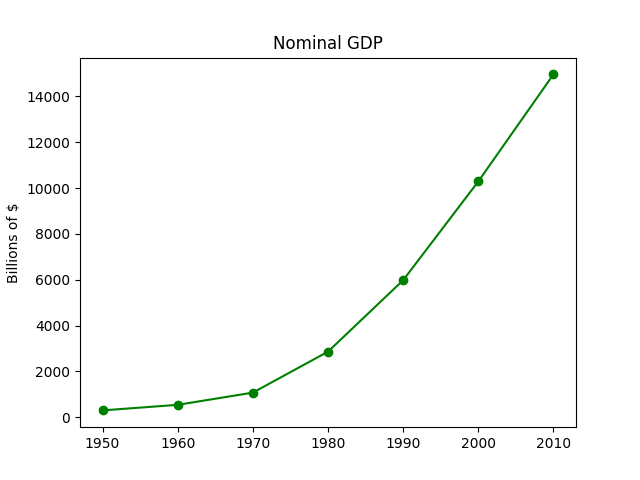
    
    - **막대그래프**
        - **이산적인 항목들에 대한 변화**를 보여줄 때 유용함
        - 아래는 영화 아카데미 시상식 수상 갯수 정리
        - 이 뒤의 코드에선 수정했지만, 막대가 가운데로 올 수 있도록 수정하는 건 최신 버전에선 알아서 처리되도록 바뀐 것 같음(처리를 해주니 오히려 밀려버리는 모습)
        
        ```python
        from matplotlib import pyplot as plt
        
        movies = ["Annie Hall", "Ben-Hur", "Casablanca", "Gandhi", "West Side Story"]
        num_oscars = [5, 11, 3, 8, 10]
        
        # 막대 너비의 기본값이 0.8이므로
        # 막대가 가운데로 올 수 있도록 왼쪽 좌표에 0.1씩 더해 주자
        xs = [i + 0.1 for i, _ in enumerate(movies)]
        
        # 왼편으로부터 x축의 위치가 xs이고 높이가 num_oscars인 막대를 그리자
        plt.bar(xs, num_oscars)
        plt.ylabel("# of Academy Awards")
        plt.title("My Favorite Movies")
        
        # 막대의 가운데에 오도록 영화 제목 레이블을 달자
        plt.xticks([i + 0.5 for i, _ in enumerate(movies)], movies)
        plt.show()
        ```
        
        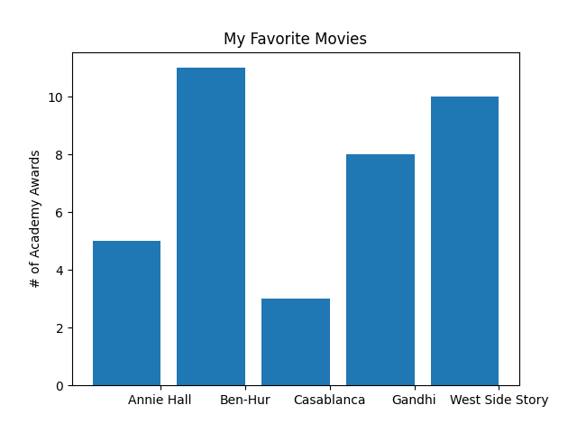
        
        - 막대 그래프를 이용해 히스토그램도 작성 가능
        
        ```python
        from collections import Counter
        from matplotlib import pyplot as plt
        
        grades = [83, 95, 91, 87, 70, 0, 85, 82, 100, 67, 73, 77, 0]
        decile = lambda grade: grade // 10 * 10
        histogram = Counter(decile(grade) for grade in grades)
        
        # keys()와 values()를 리스트로 변환
        x_values = list(histogram.keys())
        y_values = list(histogram.values())
        
        plt.bar( x_values,
                 y_values,                  # 각 막대의 높이를 정해주고
                 width=8)                   # 너비는 8로 하자
        
        plt.axis([-5, 105, 0, 5])           # x축은 -5부터 105
                                            # y축은 0부터 5
        
        plt.xticks([10 * i for i in range(11)])  # x축의 레이블은 0, 10, ..., 100
        plt.xlabel("Decile")
        plt.ylabel("# of Students")
        plt.title("Distribution of Exam 1 Grades")
        plt.show()
        ```
        
        () 함수의 작동방식 변경 때문인지 책 예제와는 다르게 plt.bar 함수에서 [x - 4 for x in histogram.keys()를 안해야지 제대로 x축 위치를 잡을 수 있었음](images/Figure_4.png)
        
        [plt.bar](http://plt.bar)() 함수의 작동방식 변경 때문인지 책 예제와는 다르게 plt.bar 함수에서 [x - 4 for x in histogram.keys()를 안해야지 제대로 x축 위치를 잡을 수 있었음
        
        ```python
        mentions = [500, 505]
        years = [2013, 2014]
        
        plt.bar(years, mentions, 0.8)
        plt.xticks(years)
        plt.ylabel("# of times I heard someone say 'data science'")
        
        # 이렇게 하지 않으면 matplotlib이 x축에 0, 1 레이블을 달고
        # 주변부 어딘가에 +2.013e3 라고 표기해둘 것이다.
        plt.ticklabel_format(useOffset=False)
        
        # 오해를 불러일으키는 y축은 500 이상의 부분만 보여줄 것이다
        plt.axis([2012.5, 2014.5, 499, 506])
        plt.title("Look at the 'Huge' Increase!")
        plt.show()
        
        # y축을 적합하게 변경
        plt.axis([2012.5, 2014.5, 0, 550])
        plt.title("Not So Huge Anymore")
        plt.show()
        ```
        
        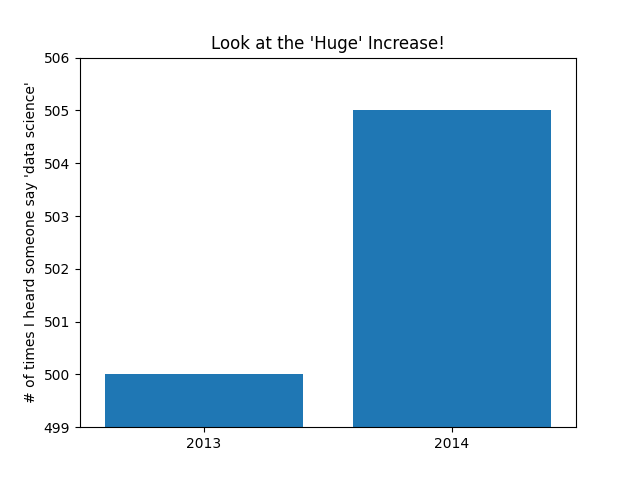
        
        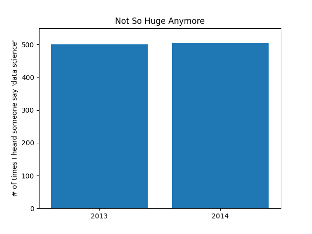
        
    - 선 그래프
        - `plt.plot()` 을 이용하면 선 그래프 그리기 가능
        - 어떤 경향을 보여줄 때 유용
        
        ```python
        from matplotlib import pyplot as plt
        
        variance = [1, 2, 4, 8, 16, 32, 64, 128, 256]
        bias_squared = [256, 128, 64, 32, 16, 8, 4, 2, 1]
        total_error = [x + y for x, y in zip(variance, bias_squared)]
        xs = [i for i, _ in enumerate(variance)]
        
        # 한 차트에 여러 개의 series를 그리기 위해
        # plt.plot을 여러 번 호출할 수 있다
        plt.plot(xs, variance, 'g-', label='variance')      # 초록색 실선
        plt.plot(xs, bias_squared, 'r-.', label='bias^2')   # 붉은색 점선
        plt.plot(xs, total_error, 'b:', label='total error') # 파란색 점선
        
        # 각 series에 label을 미리 달아놨기 때문에
        # 범례(legend)를 어렵지 않게 그릴 수 있다
        # 여기서 loc=9는 "top center(위쪽 중앙)"을 의미한다
        plt.legend(loc=9)
        plt.xlabel("model complexity")
        plt.title("The Bias-Variance Tradeoff")
        plt.show()
        ```
        
        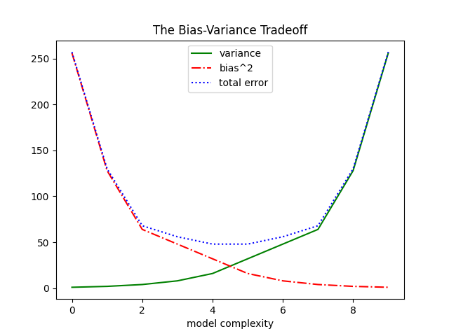
        
    - 산점도(scatterplots)
        - 두 변수 간의 연관 관계를 보여주고 싶을 때 유용
        - 아래는 각 사용자의 친구 수와 그들이 매일 사이트에서 체류하는 시간 사이의 연관성
        
        ```python
        from matplotlib import pyplot as plt
        
        friends = [ 70, 65, 72, 63, 71, 64, 60, 64, 67]
        minutes = [ 175, 170, 205, 120, 220, 130, 105, 145, 190]
        labels = ['a', 'b', 'c', 'd', 'e', 'f', 'g', 'h', 'i']
        
        plt.scatter(friends, minutes)
        
        # 각 포인트에 레이블을 달자
        for label, friend_count, minute_count in zip(labels, friends, minutes):
            plt.annotate(label,
                         xy=(friend_count, minute_count),       # label을 데이터 포인트 근처에 두되
                         xytext=(5, -5),                        # 약간 떨어져 있게 하자
                         textcoords='offset points')
            
        plt.title("Daily Minutes vs. Number of Friends")
        plt.xlabel("# of friends")
        plt.ylabel("daily minutes spent on the site")
        plt.show()
        ```
        
        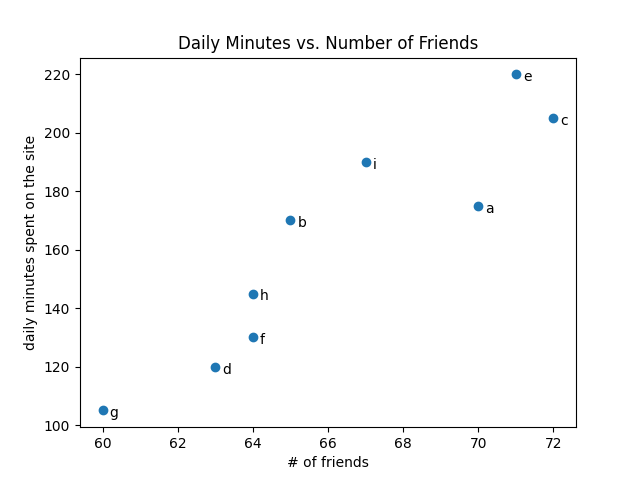
        
        - 변수들끼리 비교할 때, matplotlib가 자동으로 축의 범위를 설정하게 하면 공정한 비교를 못하게 될 수 있음
        - 따라서 plt.axis(”equal”)을 추가해줄 필요가 있다
        
        ```python
        from collections import Counter
        from matplotlib import pyplot as plt
        
        test_1_grades = [ 99, 90, 85, 97, 80 ]
        test_2_grades = [ 100, 85, 60, 90, 70 ]
        
        plt.scatter(test_1_grades, test_2_grades)
        plt.title("Axes Aren't Comparable")
        plt.xlabel("test 1 grade")
        plt.ylabel("test 2 grade")
        plt.axis("equal")
        plt.show()
        ```
        
        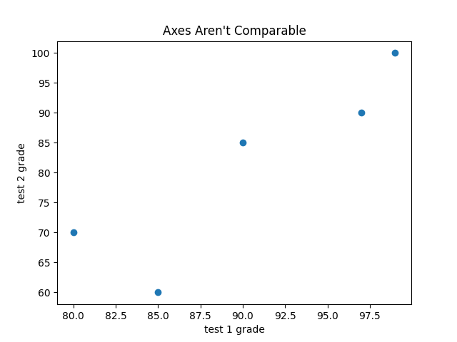
        
        plt.axis("equal") 미사용시
        
        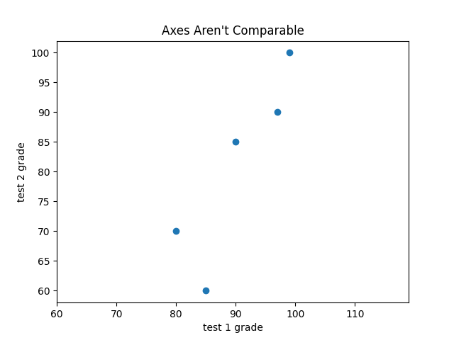
        
        plt.axis("equal") 사용시
        
    - 이후 더 공부하려면 이하의 라이브러리를 활용해보길 추천
        - seaborn
        - D3.js
        - Bokeh
        - ggplot
        
- **선형대수(linear algebra)**
    - 선형대수: 데이터 분석에 필요한 각종 계산을 돕는 학문
    - 데이터 분석을 하려면 수많은 숫자로 이루어진 데이터를 다루어야 하는데, 선형대수를 사용하면 복잡한 계산 과정을 간단한 수식으로 서술 가능함
    - 데이터는 개수나 형태에 따라 크게 스칼라(scalar), 벡터(vector), 행렬(matrix), 텐서(tensor) 유형으로 나뉨
    - 텐서 > 행렬 > 벡터 > 스칼라
    - 벡터
        - 간단히 표현하면, “크기와 방향을 가진 화살표”
        - 다차원 데이터를 표현하는 데 적합. 각 데이터 포인트를 n차원 공간의 점으로 나타냄
        - 데이터 과학에선 벡터끼리 더하거나 상수와 곱해지면 새로운 벡터를 생성하는 개념적인 도구라고 이해하면 편함
        - 머신러닝에서는 각 데이터 샘플을 특징 벡터로 표현하여 모델에 입력하여, 특정 특징(예: 나이, 소득, 키 등)을 나타냄
        - 벡터 더하기: 두 개의 벡터를 더해서 하나의 벡터로 만들 수 있다. 예를 들어, 물체에 두 방향에서 힘이 가해질 때, 두 힘을 더해서 전체 힘의 방향과 크기를 계산 가능
        - 데이터 과학에선 각 벡터 상에서 같은 위치에 있는 성분끼리 더하는 것
        
        ```python
        def vector_add(v, w):
            """각 성분끼리 더한다"""
            return [v_i + w_i
                    for v_i, w_i in zip(v, w)]
                    
        # reduce를 사용하여 벡터의 합을 계산
        def vector_sum(vectors):
        		return reduce(vector_add, vectors)
        		
        # partial을 사용하여 vector_sum을 더 간단하게 표현
        vector_sum = partial(reduce, vector_add)
        ```
        
        - 벡터의 내적: 벡터가 어느 방향으로 얼마나 겹쳐져 있는가를 나타냄
        - 좀 더 자세히 설명하자면, 벡타 1이 벡터 2 방향으로 얼마나 멀리 뻗어져 나가는지를 나타낸다. 다른 관점에서 보자면 내적은 벡터 1이 벡터 2로 투영된 길이를 나타낸다.
        - 내적의 개념을 사용하면, 각 성분의 제곱 값의 합을 쉽게 구할 수 있음
        
        ```python
        def dot(v, w):
            """v_1 * w_1 + ... + v_n + w_n"""
            return sum(v_i * w_i
                       for v_i, w_i in zip(v, w))
        
        def sum_of_squares(v):
            """v_1 * v_1 + ... + v_n * v_n"""
            return dot(v, v)
        ```
        
        - 제곱 값의 합을 이용하면 벡터의 크기도 계산 가능함
        
        ```python
        def magnitude(v):
            return math.sqrt(sum_of_squares(v))         # math.sqrt는 제곱근을 계산해주는 함수
        ```
        
        - 이를 응용해 두 벡터 간의 거리도 계산 및 정의가 가능하다
        
        ```python
        def vector_subtract(v, w):
            """각 성분끼리 뺀다"""
            return [v_i - w_i
                    for v_i, w_i in zip(v, w)]
        
        def squared_distance(v, w):
            """(v_1 - w_1) ** 2 + ... + (v_n - w_n) ** 2"""
            return sum_of_squares(vector_subtract(v, w))
        
        def distance(v, w):
            return math.sqrt(squared_distance(v, w))
        
        # magnitude 메소드로 더욱 깔끔하게 정리
        def distance(v, w):
            return magnitude(vector_subtract(v, w))
        ```
        
        - 벡터를 list로 표현하는 건 원리 설명엔 용이하지만 성능적으론 굉장히 비효율적
        - 따라서 실제 코딩에선 NumPy 라이브러리를 사용할 것
        
    - 행렬
        - 2차원으로 구성된 숫자의 집합 (list의 list)
        - 행렬 A → len(A)개의 행, len(A[0])의 열로 구성
        - A[i] → i번째 행
        
        ```python
        def make_matrix(num_rows, num_cols, entry_fn):
            """(i, j)번째 원소가 entry_fn(i, j)인
            num_rows x num_cols list를 반환"""
            return [[entry_fn(i, j)                     # i가 주어졌을 때, list를 생성한다
                     for j in range(num_cols)]          # [entry_fn(i, 0), ... ]
                     for i in range(num_rows)]          # 각 i에 대해 하나의 list를 생성한다
        
        def is_diagonal(i, j):
            """대각선의 원소는 1, 나머지 원소는 0"""
            return 1 if i == j else 0
        
        identity_matrix = make_matrix(5, 5, is_diagonal)
        print(identity_matrix)
        
        # [[1, 0, 0, 0, 0]],
        # [[0, 1, 0, 0, 0]],
        # [[0, 0, 1, 0, 0]],
        # [[0, 0, 0, 1, 0]],
        # [[0, 0, 0, 0, 1]]
        ```
        
        - 행렬이 중요한 이유
            - 여러 벡터로 구성된 데이터셋을 행렬로 표현 가능
            - k차원의 벡터를 n차원 벡터로 변환해주는 선형함수를 n x k 행렬로 표현 가능
            - 행렬로 이진관계를 표현 가능
            
            ```python
                   # 사용자 0  1  2  3  4  5  6  7  8  9
                   #
            friendships = [[0, 1, 1, 0, 0, 0, 0, 0, 0, 0],      # 사용자0
                           [1, 0, 1, 1, 0, 0, 0, 0, 0, 0],      # 사용자1
                           [1, 1, 0, 1, 0, 0, 0, 0, 0, 0],      # 사용자2
                           [0, 1, 1, 1, 0, 1, 1, 1, 1, 0],      # 사용자3
                           ...,
                           [0, 1, 0, 1, 0, 0, 1, 1, 1, 0]       # 사용자9
                          ]
            
            friendships[0][2] == 1      # 참, 사용자 0과 2는 친구이다
            friendships[0][8] == 0      # 거짓, 사용자 0과 8은 친구가 아니다
            
            friends_of_five = [i
            									 for i, is_friend in enumerate(friendships[5])
            									 if is_friend]
            ```
            
- **통계**
    - 통계는 데이터를 이해하는 바탕이 되는 수리적 비법
    - 중심 경향성: 데이터의 중심이 어디있는지를 나타내는 지표
    - 중심 경향성은 대부분의 경우, 데이터의 값을 데이터 포인트의 개수로 나눈 평균을 사용
    
    ```python
    def mean(x):
        return sum(x) / len(x)
    ```
    
    - 가끔은 중앙값도 필요함
    
    ```python
    def median(v):
        """v의 중앙값을 계산"""
        n = len(v)
        sorted_v = sorted(v)
        midpoint = n / 2
    
        if n % 2 == 1:
            # 데이터 포인트의 개수가 홀수면 중앙값을 반환
            return sorted_v[midpoint]
        else:
            # 데이터 포인트의 개수가 짝수면 두 중앙값의 평균을 반환
            lo = midpoint - 1
            hi = midpoint
            return (sorted_v[lo] + sorted_v[hi]) / 2
    ```
    
    - 평균과 중앙값 비교
        - 평균: 계산이 간편, 데이터의 변화에 따른 값의 변화가 부드러움, 이상치에 민감함
        - (마이클 조던이 지리학과 졸업 → 해당 대학 지리학과 졸업생 초봉이 제일 높다고 조사됨)
        - 중앙값: 계산을 위해선 데이터 정렬이 필요, 주어진 데이터의 변화에 둔감
    - 흔치는 않지만 최빈값을 살펴보는 경우도 있음
    
    ```python
    from collections import Counter
    
    def mode(x):
        """최빈값이 하나보다 많다면 list를 반환"""
        counts = Counter(x)
        max_count = max(counts.values())
        return [x_i for x_i, count in counts.items()
                if count == max_count]
    ```
    
    - 산포도(dispersion):
        - 데이터가 얼마나 퍼져 있는지를 나타냄
        - 일반적으로 0과 근접한 값이면 거의 퍼져있지 않다는 의미, 큰 값이면 매우 퍼져있다는 의미
        
        ```python
        # 가장 큰 값 - 작은 값의 차이를 나타내는 범위는 산포도를 나타내는 가장 간단한 통계치다
        # 데이터 전체에 의존하지 않음 (중앙값과 비슷함)
        def data_range(x):
            return max(x) - min(x)
        ```
        
        - 분산(variance)
        
        ```python
        # 분산은 산포도를 측정하는 약간 더 복잡한 개념
        def de_mean(x):
            """x의 모든 데이터 포인트에서 평균을 뺌(평균을 0으로 만들기 위해)"""
            """데이터를 평균 중심으로 이동시켜서 데이터의 분포를 더 쉽게 이해하기 위함"""
            x_bar = mean(x)
            return [x_i - x_bar for x_i in x]
        
        def variance(x):
            """x에 두 개 이상의 데이터 포인트가 존재한다고 가정"""
            n = len(x)
            deviations = de_mean(x)
            return sum_of_squares(deviations) / (n - 1)
         
         """
         식을 살펴보면 편차의 제곱의 평균을 계산하는 데 n 대신에 n - 1로 나누는 것을
         확인할 수 있다. 이는 편차의 제곱합을 n으로 나누면 bias 때문에 모분산에 대한
         추정값이 실제 모분산보다 작게 계산되는 것을 보정해주기 위함이다.
         """
        ```
        
        - 분산 대신에 원래 단위와 같은 단위를 가지는 표준편차를 이용할 때가 많음
        
        ```python
        # 분산의 단위는 기존 단위의 제곱이므로,
        # 분산 대신에 원래 단위와 같은 단위를 가지는 표준편차를 이용할 때가 많다
        import math
        
        def standard_deviation(x):
            return math.sqrt(variance(x))
        ```
        
        - 범위와 표준편차도 평균처럼 이상치에 민감 → 상위, 하위 25%에 해당되는 값의 차이 계산하면 더 안정적
    - 상관관계
        - 공분산
            - 분산: 하나의 변수가 변수의 평균에서 얼마나 멀리 떨어져 있는지 계산
            - 공분산: 두 변수가 각각의 평균에서 얼마나 멀리 떨어져있는지 계산
            
            ```python
            def covariance(x, y):
                n = len(x)
                return dot(de_mean(x), de_mean(y)) / (n - 1)
                
            # dot: 각 성분별로 곱한 값을 더해줌
            ```
            
            - 하지만 공분산의 증감이 상관관계의 변화를 의미하지 않기 때문에, 공분산에서 각각의 표준편차를 나눠 준 상관관계를 더 자주 살펴봄
            - 예) 친구 수 x 하루 사용량(분)에서 친구 수가 2배로 늘어난다고 상관관계 변화 x
            
            ```python
            def correlation(x, y):
                stdev_x = standard_deviation(x)
                stdev_y = standard_deviation(y)
                if stdev_x > 0 and stdev_y > 0:
                    return covariance(x, y) / stdev_x / stdev_y
                else:
                    return 0                # 편차가 존재하지 않는다면 상관관계는 0
            ```
            
        - 심슨의 역설
            - 혼재변수가 누락되어 상관관계가 잘못 계산되는 문제
            - 두 변수의 비교 과정에서 “다른 모든 것이 동일”하다는 전제가 잘못되어 발생
        - 추가적인 주의점
            - 상관관계 0 → 반드시 두 변수 사이에 선형적인 관계가 없나?
            - 상관관계 0이 아님 → 반드시 두 변수 사이에 관계가 있나?
            - “상관관계는 인과관계를 의미하지 않는다”
- **확률**
    - 확률(probability): 어떠한 사건의 공간에서 특정 사건이 선택될 때 발생하는 불확실성을 수치적으로 나타내는 것
    - 확률과 관련된 기초 용어 (책의 기호들 모르겠어서 따로 정리)
        - P(A): 어떤 사건 A가 일어날 확률
        - P(A) = 0: 절대 일어나지 않음 / P(A) = 1: 반드시 일어남
        - P(¬A): 어떤 사건 A가 일어나지 않을 확률
        - P(A, B): 결합 확률, 사건 A와 사건 B가 동시에 일어날 확률
        - P(A|B): 조건부 확률, B라는 조건이 주어진 상황에서, A라는 사건이 일어날 확률
        - 우도(가능도, likelihood): 어떤 현상이 발생했을 때, 이 현상이 어떤 모집단에서 발생했는지에 관한 척도
            
            
            
            
            
            
            
    
    - 독립 사건과 종속 사건
        - 독립 사건: 사건 A와 사건 B가 서로 영향을 주지 않는 경우
        - 종속 사건: 사건 A의 발생 여부가 사건 B의 발생 여부에 대한 정보(혹은 그 반대)를 제공하는 경우
        - A와 B가 독립 사건 → P(A, B) = P(A) * P(B)
        - A와 B가 종속 사건 → P(A, B) = P(A|B) * P(B)
    - 베이즈 정리
        - 새로운 정보가 주어졌을 때, 기존 확률을 업데이트하는 방법을 제공하는 확률 이론
        - 조건부 확률을 반대로 뒤집는 확률 이론
            
            
            
            이 때, P(A∩B)=P(A)⋅P(B|A)
            
        - 베이즈 정리 수식의 용어 설명
            - P(A|B): 사후 확률 (Posterior Probability): 구하고 싶은 확률
            - P(B|A): 가능도 (Likelihood): A가 참일 때 B가 발생할 확률
            - P(A): 사전 확률 (Prior Probability): B라는 정보를 알기 전, A에 대한 기본적인 확률
            - P(B): 증거의 확률(Evidence): B라는 정보가 발생할 전체 확률
        - 즉, 사전 확률 P(A)를 새로운 정보 P(B|A)를 통해 사후 확률 P(A|B)로 업데이트하는 것을 의미
        - 다른 표현식
            - P(F) = P(F,E) + (F, ¬E)를 이용하면
            - P(E|F) = P(F|E)P(E) / [P(F|E)P(E) + P(F|¬E)P(¬E)]로 베이즈 정리를 표현하는 것도 가능
        - 구체적인 예시
            - **질병에 걸릴 확률 (P(E))**: 0.0001 (0.01%)
            - **질병이 없을 확률 (P(¬E))**: 0.9999 (99.99%)
            - **질병이 있을 때 양성 판정 확률 (P(F∣E))**: 0.99 (99%)
            - **질병이 없을 때 양성 판정 확률 (P(F∣¬E))**: 0.01 (1%)
            - 테스트 결과가 양성일 때, 실제로 질병에 걸렸을 확률은? → 약 0.98%
            - 질병의 희귀성이 굉장히 높은 경우, 양성 판정 확률이 높아도 모집단 명수 차이가 워낙 크다보니 실제 질병 관측 확률이 굉장히 낮게 나오는 것을 확인 가능함
    - 확률 변수
        - 불확실한 사건의 결과를 수로 나타낸 것
        - 확률 분포와 연관되어 있는 변수
            - 확률 분포: 확률 변수가 가질 수 있는 모든 값과 그 값에 대한 확률의 관계
        - 주사위를 던졌을 경우에 확률변수 X → X∈{1,2,3,4,5,6}
        - P(X = k) = 1/6 (k= 1, 2, …, 6)
    - 확률 변수의 기댓값
        - 확률 변수가 가질 수 있는 값들의 “평균값”을 확률을 고려해 계산한 것
        - 즉, 모든 확률 변수의 확률을 해당 확률 변수의 값으로 가중평균한 값
            - 가중 평균: 각 값에 가중치를 곱한 후, 그 값들의 합을 계산한 것
        - 주사위 던지기 → (1 + 2 + 3 + 4+ 5 + 6) / 6 = 3.5
    - 확률 밀도 함수(PDF)
        - 이산형 분포: 확률 변수가 정해진 값만 가질 수 있는 경우
        - 연속형 분포: 확률변수가 연속적인 값을(예: 실수) 가질 수 있는 경우
        - 확률 밀도 함수: 연속적인 확률 변수의 값이 특정 구간에 존재할 가능성을 나타내는 함수
        - 특정 값의 확률은 항상 **0**이고, 구간의 확률은 PDF를 적분으로 계산
        
        ```python
        def uniform_pdf(x):
            return 1 if x >= 0 and x < 1 else 0
        ```
        
    - 누적분포함수(cumulative distribution function, cdf)
    
    ```python
    def uniform_cdf(x):
        "균등분포를 따르는 확률변수의 값이 x보다 작거나 같을 확률을 반환"
        if x < 0: return 0                  # 균등분포의 확률은 절대로 0보다 작을 수 없음
        elif x < 1: return x                # 예시: P(X <= 0.4) = 0.4
        else: return 1                      # 균등분포의 확률은 항상 1보다 작음
    ```
    
    - 정규 분포(normal distribution)
        - 자연현상이나 데이터에서 자주 나타나는 패턴을 설명하는 확률 분포
            
            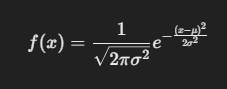
            
        - 평균 근처에 값이 몰려있고, 평균에서 멀어질수록 값이 적어지는 종 모양의 좌우대칭 곡선
        - μ: 평균, σ: 표준편차
        - 평균 → 종의 중심
        - 표준편차 → 종의 폭
        
        ```python
        import math
        from matplotlib import pyplot as plt
        
        def normal_pdf(x, mu=0, sigma=1):
            sqrt_two_pi = math.sqrt(2 * math.pi)
            return (math.exp(-(x-mu) ** 2 / 2 / sigma ** 2) / (sqrt_two_pi * sigma))
        
        xs = [x / 10.0 for x in range(-50, 50)]
        plt.plot(xs, [normal_pdf(x,sigma=1) for x in xs], '-', label='mu=0, sigma=1')
        plt.plot(xs, [normal_pdf(x,sigma=2) for x in xs], '--', label='mu=0, sigma=2')
        plt.plot(xs, [normal_pdf(x,sigma=0.5) for x in xs], ':', label='mu=0, sigma=0.5')
        plt.plot(xs, [normal_pdf(x,mu=-1) for x in xs], '-.', label='mu=-1, sigma=1')
        plt.legend()
        plt.title("Various Normal pdfs")
        plt.show()
        ```
        
        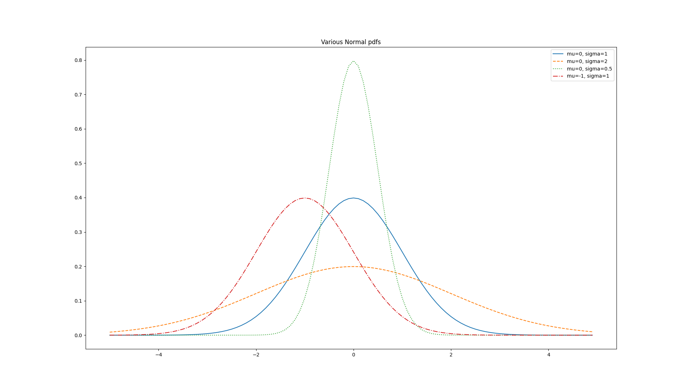
        
    - 표준정규분포(standard normal distribution)
        - μ(평균) = 0이고 σ(표준편차) = 1인 정규분포
        - 일반 정규분포 → 표준정규분포: Z = (X - μ) / σ
        - 표준정규분포 → 일반 정규분포: X = σZ+μ
        - 변환하는 이유
            - 표준화로 계산 간소화
            - 데이터 비교
            - 모델링과 통계 분석
        - 가끔씩 특정 확률을 갖는 확률변수의 값을 찾기 위해, normal_cdf의 역함수가 필요할 때도 있는데, 이 때는 정해진 공식이 없어서 이진 탐색으로 탐색
        
        ```python
        import math
        from matplotlib import pyplot as plt
        
        def normal_cdf(x, mu=0, sigma=1):
            """정규분포의 누적분포함수(CDF).
            주어진 평균(mu)와 표준편차(sigma)를 사용하여 특정 값 x 이하의 확률을 계산."""
            return (1 + math.erf((x - mu) / math.sqrt(2) / sigma)) / 2
        
        def inverse_normal_cdf(p, mu=0, sigma=1, tolerance=0.00001):
            """
            정규분포의 역누적분포함수(Inverse CDF)를 계산.
            특정 확률(p)에 해당하는 값을 찾기 위해 이진 검색을 사용.
            
            Args:
                p (float): 특정 확률 (0 <= p <= 1).
                mu (float): 정규분포의 평균 (기본값: 0).
                sigma (float): 정규분포의 표준편차 (기본값: 1).
                tolerance (float): 계산 정밀도 (기본값: 0.00001).
            
            Returns:
                float: 확률 p에 해당하는 정규분포의 값.
            """
            
            # 표준정규분포로 변환: 평균(mu)와 표준편차(sigma)가 기본값이 아니라면 변환.
            if mu != 0 or sigma != 1:
                # 표준정규분포의 역함수를 계산한 뒤, 원래 분포로 변환.
                return mu + sigma * inverse_normal_cdf(p, tolerance=tolerance)
            
            # 이진 검색 초기화
            low_z, low_p = -10.0, 0             # 초기 하한(low_z): CDF(-10) ≈ 0
            hi_z, hi_p = 10.0, 1                # 초기 상한(hi_z): CDF(10) ≈ 1
            
            # 이진 검색을 통해 확률 p에 가까운 값 찾기
            while hi_z - low_z > tolerance:
                mid_z = (low_z + hi_z) / 2      # 중간 값(mid_z) 계산
                mid_p = normal_cdf(mid_z)       # 중간 값에 대한 누적분포값(CDF) 계산
                
                if mid_p < p:
                    # 현재 중간 값이 확률 p보다 작다면, 하한을 mid_z로 이동
                    low_z, low_p = mid_z, mid_p
                elif mid_p > p:
                    # 현재 중간 값이 확률 p보다 크다면, 상한을 mid_z로 이동
                    hi_z, hi_p = mid_z, mid_p
                else:
                    # 중간 값이 정확히 p와 같다면 검색 종료
                    break
        
            # 최종적으로 근사된 중간 값을 반환
            return mid_z
        
        # 테스트 코드
        # 표준정규분포에서 누적확률 p = 0.95에 해당하는 값을 찾음
        p = 0.95
        result = inverse_normal_cdf(p)
        result
        
        ```
        
    - 중심극한정리(central limit theorem)
         - “독립적인 동일 분포의 확률 변수들의 합이나 평균은, 변수의 분포 형태와 상관없이 표본 크기 n이 충분히 크다면 정규분포에 점점 가까워진다”는 통계학의 핵심 이론 중 하나
         - 베르누이 확률 변수
             - 성공/실패 두 가지 결과만 가능한 단일 실험을 나타내는 확률변수
         - 이항 분포(Binomial Distribution)
             - 성공과 실패 두 가지 결과만 가능한 시행을 여러 번 독립적으로 반복하는 실험에서 특정 조건을 만족하는 결과(성공)가 나타날 확률을 모델링하는 확률 분포
             
             
             
             - 중심극한정리 → 이항 분포 샘플 크기(n)가 커질수록 정규 분포에 가까워질 수 있음을 보장
             
 - 가설과 추론
     - 가설: 주장을 의미, 특정 분포에 대한 확률변수의 관측치
     - 귀무가설(h0, null hypothesis): 어떤 기본적인 가설
     - 대립가설(h1, alternative hypothese): 비교하고 싶은 가설
     - 고전적인 가설검정 → 귀무가설과 대립가설을 설정하고, 귀무가설을 기각할지 말지를 결정
     - 대칭 구간 계산법
         - 확률이 주어졌을 때, 평균을 중심으로 하는 (대칭적인) 구간 구하기
         
         ```python
         import math
         
         def normal_approximation_tobinomial(n, p):
             """Binomial(n, p)"에 해당되는 mu(평균)와 sigma(표준편차) 계산"""
             mu = p * n
             sigma = math.sqrt(p * (1 - p) * n)
             return mu, sigma
         
         # 누적분포함수는 확률 변수가 특정 값보다 작을 확률을 나타낸다
         normal_probability_below = normal_cdf
         
         # 만약 확률변수가 특정 값보다 작지 않다면, 특정 값보다 크다는 것을 의미한다
         def normal_probability_above(lo, mu=0, sigma=1):
             return 1 - normal_cdf(hi, mu, sigma) - normal_cdf(lo, mu, sigma)
         
         # 만약 확률변수가 hi보다 작고 lo보다 작지 않다면, 확률 변수는 hi와 lo 사이에 존재한다
         def normal_probability_between(lo, hi, mu=0, sigma=1):
             return normal_cdf(hi, mu, sigma) - normal_cdf(lo, mu, sigma)
         
         # 만약 확률변수가 범위 밖에 존재한다면, 범위 안에 존재하지 않다는 것을 의미한다
         def normal_probability_outside(lo, hi, mu=0, sigma=1):
             return 1 - normal_probability_between(lo, hi, mu, sigma)
         
         ## 위 코드는 이항분포를 정규분포로 근사한 후, 정규분포의 특정 구간에서 확률을 계산하는 방법을 구현
         ```
         
         - 유의수준: 제1종 오류를 얼마나 허용할 것인지를 의미하는 수준
         - 제1종 오류: 비록 귀무가설이 참이지만, 귀무가설을 기각하는 false positive(가양성) 오류
         - 검정력: 제2종 오류를 범하지 않을 확률
         - 제2종 오류: 귀무가설이 거짓이지만 귀무가설을 기각하지 않는 오류
         
         ```python
         def normal_upper_bound(probability, mu=0, sigma=1):
             """P(Z <= z) = probability인 z값을 반환"""
             return inverse_normal_cdf(probability, mu, sigma)
         
         def normal_lower_bound(probability, mu=0, sigma=1):
             """P(Z >= z) = probability인 z값을 반환"""
             return inverse_normal_cdf(1 - probability, mu, sigma)
         
         def normal_two_sided_bounds(probability, mu=0, sigma=1):
             """입력한 probability 값을 포함하고,
             평균을 중심으로 대칭적인 구간을 반환"""
             tail_probability = (1 - probability) / 2
         
             # 구간의 상한은 tail_probability 값 이상의 확률 값을 갖고 있다
             upper_bound = normal_lower_bound(tail_probability, mu, sigma)
         
             # 구간의 하한은 tail_probability 값 이하의 확률 값을 갖고 있다
             lower_bound = normal_upper_bound(tail_probability, mu, sigma)
         
             return lower_bound, upper_bound
         ```
         
     - p-value
         - 어떤 확률 값을 기준으로 구간을 선택하는 대신에, 귀무가설이 참이라고 가정하고 실제로 관측된 값보다 더 극단적인 값이 나올 확률을 구하는 것
         - 귀무가설 아래에서 관측값 또는 더 극단적인 값이 나올 확률
         - 관측값의 극단성을 평가하여 가설 검정에 사용
         - 일반적으로 p-value가 작을수록 귀무가설을 기각
         
         
         
         
         
         - 꼬리 영역
             - 정규분포에서 멀리 떨어진 극단적인 값
             - 관측값이 평균에서 멀리 벗어날수록 꼬리 영역의 확률이 작아짐
         - 유의수준 (𝛼)
             - 귀무가설을 기각할 기준 확률
             - 보통 5% (𝛼 = 0.05)를 사용
                 - p ≤ 𝛼 : 귀무가설 기각
                 - p > 𝛼 : 귀무가설 유지
         - 연속성 수정
             - 이산형 값 → 연속형 값 변환 시, 정확성을 높이기 위해 0.5를 더하거나 빼는 방법
             - 조정 원리:
             - 𝑋 = 530을 정규분포로 근사할 때, 정규분포는 530이라는 값을 정확히 나타낼 수 없음
             - 대신, 이항분포에서 𝑋 = 530의 확률은 정규분포에서 529.5 ≤ 𝑋 < 530.5의 확률로 대체됨
             - 이를 계산하기 위해 529.5를 사용